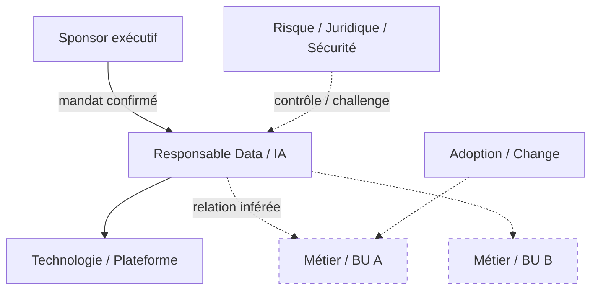
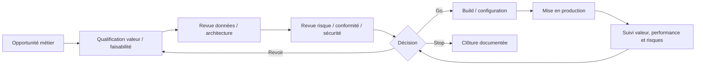
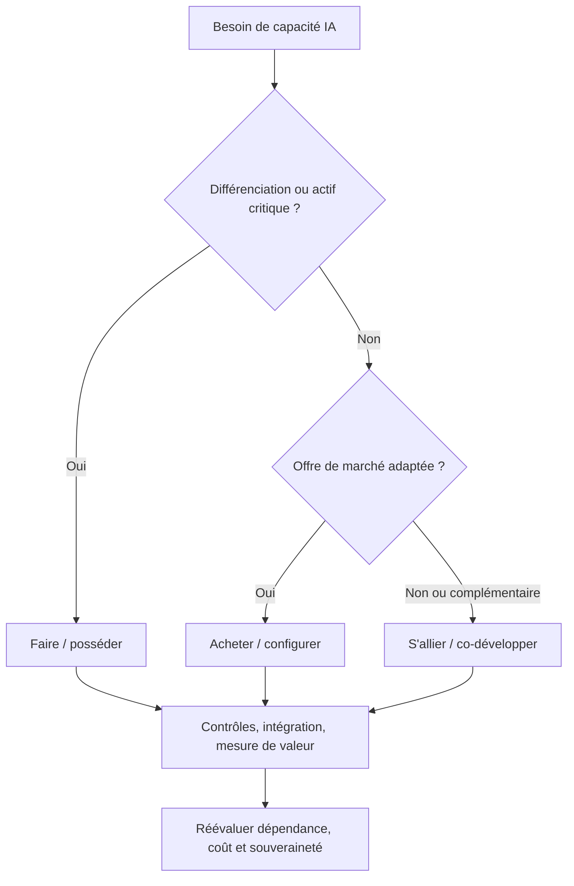

# 03b — Graphes d'organisation et de gouvernance

## Convention

- Remplacer tous les libellés entre crochets.
- Trait plein : relation confirmée ; pointillés : relation inférée.
- Ajouter la source dans le tableau de traçabilité sous chaque graphe.
- Ne jamais inventer une personne, une instance ou un lien hiérarchique.
- Citer les `Claim ID` du registre `01b_evidence_ledger.md`.
- Utiliser une fonction sans titulaire lorsque le nom n'est pas établi.

## Organigramme simplifié

### Traçabilité de l'organigramme

| Relation | Statut | Claim IDs / sources | Raisonnement | Confiance |
|---|---|---|---|---|
| À renseigner | Confirmée / inférée | C000 / S000 | À renseigner | À renseigner |

## Flux de gouvernance

### Droits de décision

| Étape | Accountable | Responsible | Consulted | Informed | Preuve / confiance |
|---|---|---|---|---|---|
| À renseigner | À renseigner | À renseigner | À renseigner | À renseigner | À renseigner |

## Flux faire / acheter / s'allier

### Posture par couche

| Couche | Faire | Acheter | S'allier | Propriété / contrôle conservé | Preuve | Confiance |
|---|---|---|---|---|---|---|
| Données | À renseigner | À renseigner | À renseigner | À renseigner | À renseigner | À renseigner |
| Infrastructure / cloud | À renseigner | À renseigner | À renseigner | À renseigner | À renseigner | À renseigner |
| Modèles | À renseigner | À renseigner | À renseigner | À renseigner | À renseigner | À renseigner |
| Orchestration / plateforme | À renseigner | À renseigner | À renseigner | À renseigner | À renseigner | À renseigner |
| Intégration et produits | À renseigner | À renseigner | À renseigner | À renseigner | À renseigner | À renseigner |
| Contrôle et adoption | À renseigner | À renseigner | À renseigner | À renseigner | À renseigner | À renseigner |
