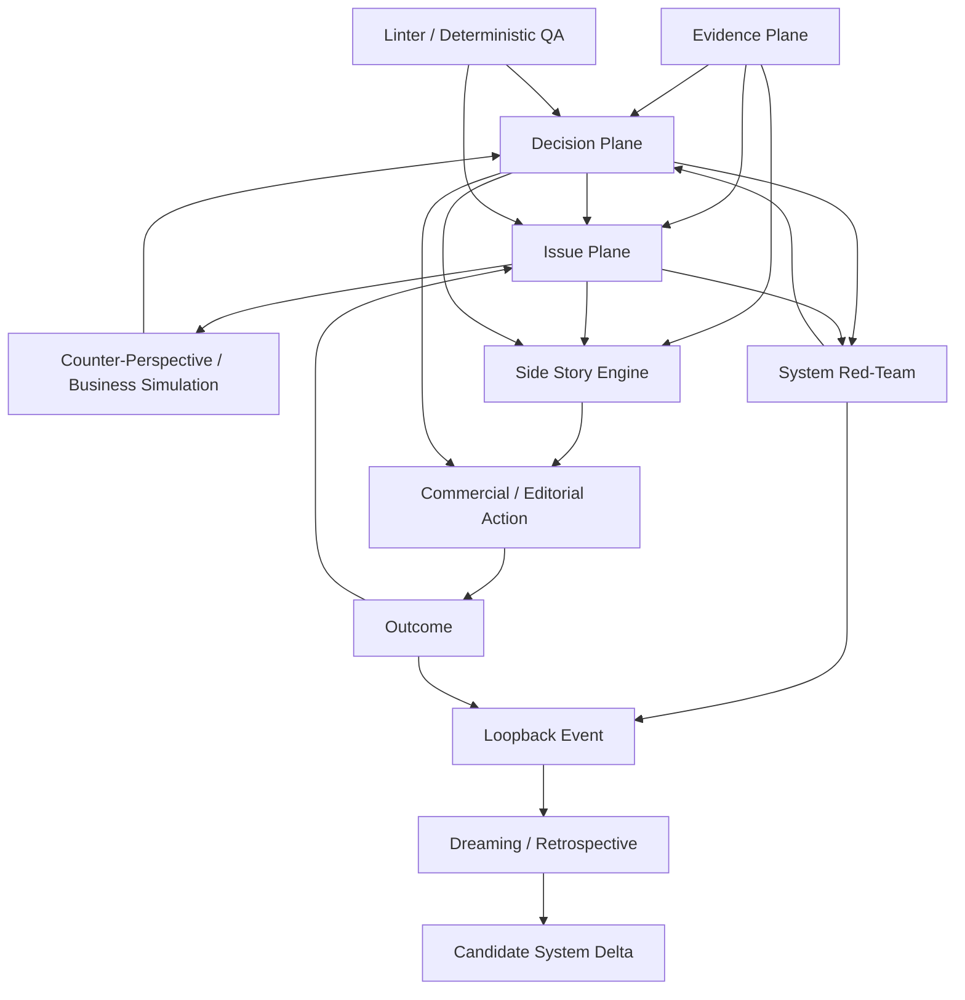

# 00 — Architecture principale : Red-Team, Issues, Side Stories et boucle commerciale

## 1. Objet

Cette spécification consolide trois idées jusque-là partiellement superposées :

1. **Red-Team système** : mécanisme technique de falsification, QA, run monitoring et revue de décision.
2. **Issue Engine** : registre fonctionnel des tensions, objections, contradictions, inconnues et opportunités non résolues.
3. **Side Story Engine** : mécanisme de composition/storytelling qui transforme un matériau validé en incise, contre-champ, dézoom, fausse piste, comparateur, callback ou angle commercial, sans jamais créer de nouvelle preuve.

Le but n'est **pas** de tout appeler « red-team ». La red-team est une primitive de revue. Les issues et side stories sont des primitives fonctionnelles. Le dreaming est la boucle d'apprentissage système.

La cible est `ai-maturity-diagnostic`, en respectant ses invariants actuels :

```text
NETWORK
→ ENTERPRISE
→ PRODUCT
→ COMMERCIAL
→ LEARNING
```

et ses handoffs :

```text
05_enterprise_demand_profile.yaml
→ 05b_use_case_inventory.yaml
→ 05c_value_chain_causal_map.yaml
→ 06_product_fit_matrix.yaml
→ 06b_contact_targets.yaml
→ 06c_reach_strategy.yaml
→ 07_engagement_hypothesis.md
```

Cette spec reste **agnostique du socle de stockage/admin**. Elle ne tranche ni Native, ni Baserow, ni Directus.

---

## 2. Séparation des plans

### 2.1 Evidence Plane
Contient les faits, sources, claims, observations, statuts épistémiques.

> Aucun autre plan ne peut promouvoir une hypothèse ou un angle narratif en preuve.

### 2.2 Decision Plane
Contient les décisions : screening, demand, product fit, target fit, reach readiness, pilot readiness, retire/wait/reactivate.

### 2.3 Issue Plane
Contient ce qui empêche, menace, nuance ou enrichit une décision : contradiction, objection probable, anti-fit, unknown, missing proof, hidden hard gate, stale assumption, unresolved role, alternative explanation, new trigger, rejected angle, reopened question.

Une issue est un artefact de travail, pas une preuve.

### 2.4 Composition Plane
Contient les `SideStory` utilisées dans les notes de fit, engagement hypotheses, scripts de discovery, messages de prospection, relances, réactivations et RETEX sectoriels.

Une side story est une **composition de matériau déjà lineagé**.

### 2.5 Action Plane
Transforme décision + issues + side stories en action : research, validate, reach, route via gatekeeper, discovery, follow-up, wait, reactivate, retire.

### 2.6 System Quality Plane
Contient linter déterministe, QA de conformité, red-team système, reader/decision QA, run monitoring et dreaming/retrospective.

---

## 3. Architecture logique



---

## 4. Vocabulaire normatif

| Terme | Fonction | Peut créer une preuve ? | Peut modifier une décision ? |
|---|---|---:|---:|
| `RedTeamReview` | Falsification système | Non | Oui |
| `Issue` | Tension/question à résoudre | Non | Non directement |
| `CounterPerspective` | Hypothèse adverse métier | Non | Oui après évaluation |
| `SideStory` | Incise / angle / dézoom | Non | Non seule |
| `LinterFinding` | Défaut déterministe | Non | Peut bloquer |
| `LoopbackEvent` | Résumé d'un apprentissage de run | Non | Non |
| `DreamingDelta` | Candidat amélioration système | Non | Seulement après promotion gouvernée |
| `Outcome` | Résultat réel d'une action | Oui si correctement sourcé | Oui |

---

## 5. Principe structurant : Issue d'abord, Story ensuite

```text
signal / contradiction / silence / objection
→ Issue
→ qualification de l'Issue
→ résolution / maintien ouverte
→ SideStory candidate si utile
→ validation
→ promotion dans un artefact/action
```

Exemple :

```text
Signal:
prospect publie sur "internal build"

Issue:
ISS-REACH-042
"Notre proposition peut être perçue comme une couche inutile"

Counter-perspective:
"Pourquoi acheter si l'équipe assume déjà le build ?"

Résolution:
le besoin n'est pas "remplacer le build",
mais tester le coût de reconstruction répétée.

SideStory:
SS-COMP-017
kind=comparator
payoff="internal build vs repeated orchestration cost"

Action:
message de discovery centré sur la répétition du coût,
pas sur "notre plateforme est meilleure".
```

---

## 6. Invariants repris du pattern Side Stories existant

- lifecycle explicite ;
- stable ID ;
- lineage ;
- `section_anchor` / `return_to` ;
- preuve indépendante du storytelling ;
- `false_lead` comme objet légitime ;
- `dezoom` pour changement d'échelle ;
- `comparator` pour contre-champ ;
- `callback` pour relance/réactivation ;
- `analytical_focus` pour un approfondissement borné.

Adaptation commerciale :

```text
candidate → validated → promoted → retired
```

La promotion signifie seulement que l'angle est suffisamment utile et lineagé pour être utilisé. Elle ne transforme jamais son contenu en fait sur le prospect.

---

## 7. Main workflow commun

```text
CONTEXT
→ EVIDENCE
→ DECISION HYPOTHESIS
→ ISSUE DETECTION
→ ISSUE TRIAGE
→ COUNTER-PERSPECTIVE
→ DECISION NARROW/PIVOT/SURVIVE
→ SIDE-STORY CANDIDATES
→ ACTION SELECTION
→ LINTER
→ DELIVERY
→ OUTCOME
→ RETROSPECTIVE
→ DREAMING
```

Le moteur est commun ; les policies diffèrent selon la zone métier.

---

## 8. Décisions d'architecture

### ADR-MAIN-001 — pas de « Red Team Everywhere »
Réserver `red-team` au plan système/QA et utiliser des termes métier ailleurs : `Issue`, `CounterPerspective`, `ObjectionSimulation`, `AngleCandidate`, `SideStory`.

### ADR-MAIN-002 — side stories = composition, jamais preuve
Toute side story référence des claims/sources/issues existants.

### ADR-MAIN-003 — storage agnostic
Contrats et services ne connaissent pas le moteur de stockage final.

### ADR-MAIN-004 — pas de score unique de « qualité »
Conserver hard gates, evidence status, issues et objections séparés des scores.

### ADR-MAIN-005 — toute action commerciale doit porter un delta
Une relance ou réactivation n'est valide que si elle apporte nouvelle preuve, nouveau trigger, nouvelle hypothèse, nouveau RETEX, nouveau routage ou nouvelle demande bornée. Une paraphrase n'est pas un delta.

---

## 9. Definition of Done globale

- `Issue`, `CounterPerspective`, `SideStory`, `RedTeamReview`, `LoopbackEvent` ont des contrats distincts ;
- aucune side story ne peut créer de preuve ;
- fit, reach, outreach et reactivation exploitent les issues sans contamination ;
- linter et red-team ont des responsabilités non chevauchantes ;
- silence/refus réels alimentent une retrospective ;
- le dreaming apprend des patterns cross-run sans auto-modifier le système ;
- chaque mutation de décision garde un falsifier et une provenance ;
- aucune décision de stockage n'est requise pour exécuter ces contrats.
